# 图书管理系统

## 设计一个图书馆理系统，有用户登陆，包括管理员登录和读者登录
## 管理员实现：新书录入、查询指定书的状态、能查询逾期的书、能查询每个用户借了哪些书，以及借书的历史
## 读者实现：借书、还书、每个用户只能借3本书，两个月内归还、能查询书的状态、能查询借了哪些书，以及借书的历史

## 数据库管理员与读者区别：admin表中status=1表示读者，status=2 表示管理员

## 具体功能如下图

## 登录页面

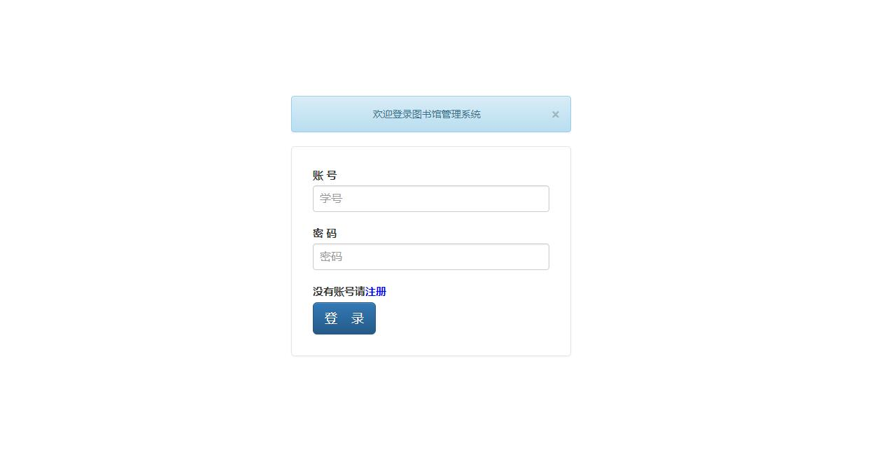

## 登录--管理员登录   账号：123456  密码：123456

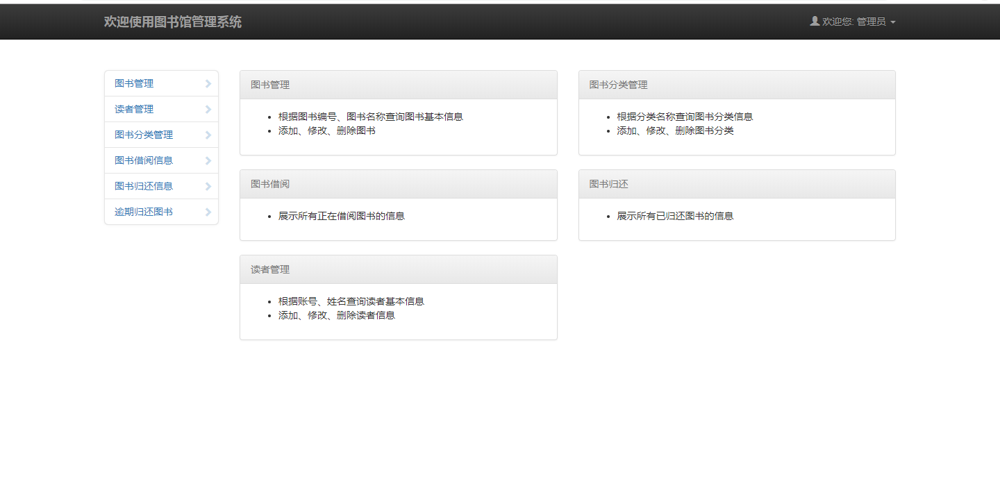

## 登录--读者登录  举例账号：123  密码：123

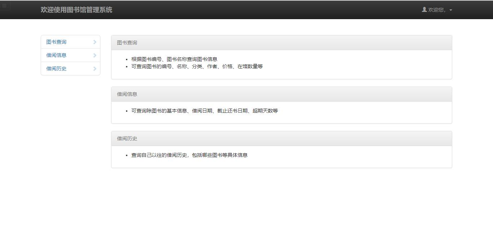

## 管理员--图书管理

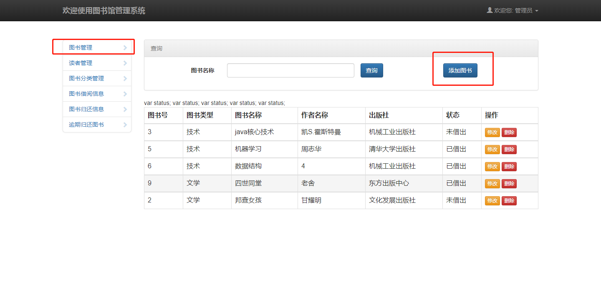

## 管理员--新书录入功能

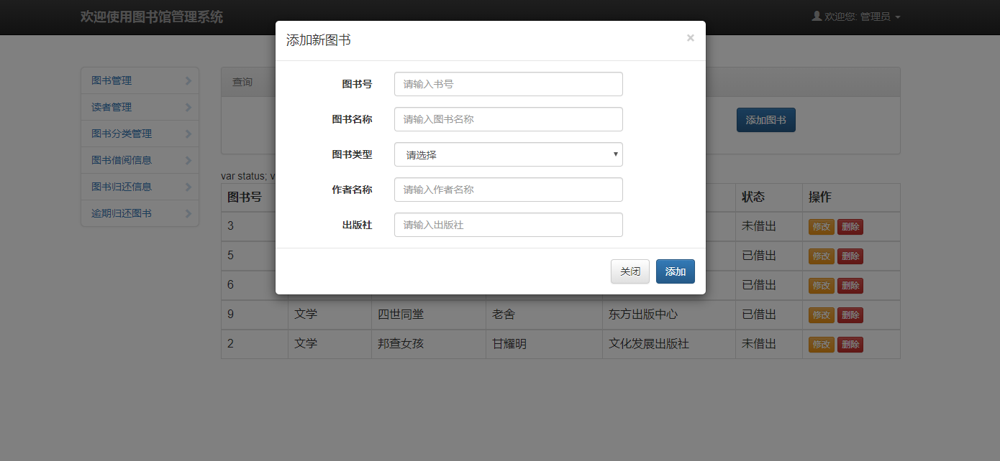

## 管理员--查询书的状态

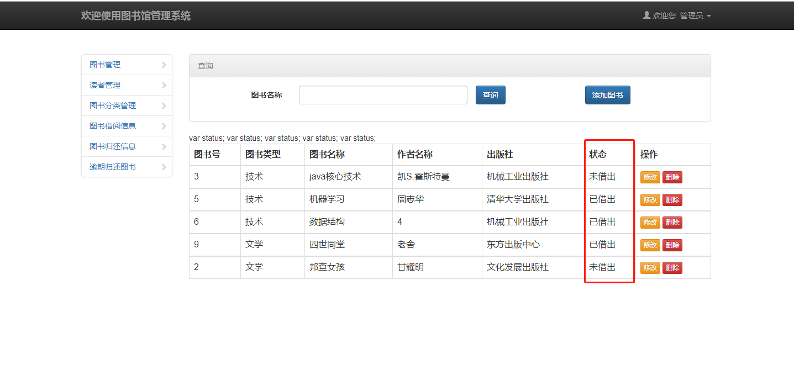

## 管理员--查询逾期的书

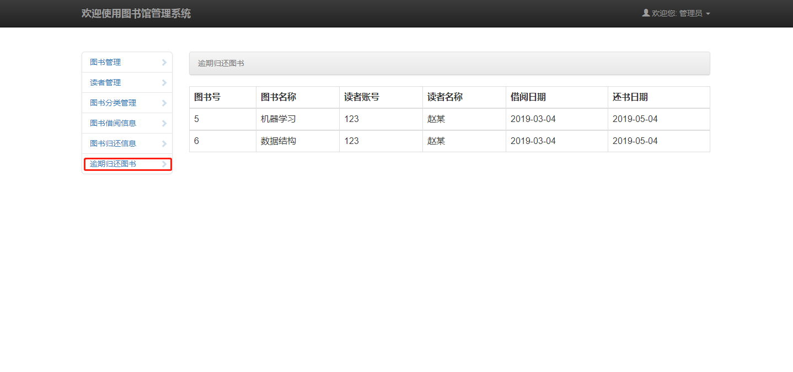

## 管理员--查询每个用户借的书

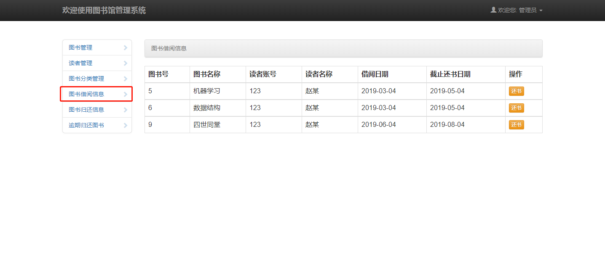

## 管理员--查询每个用户借书历史

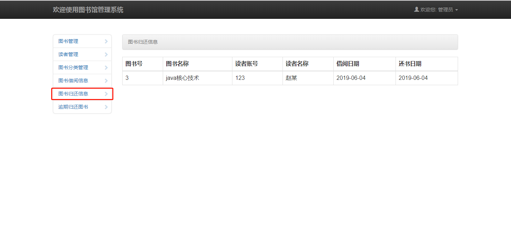

## 读者图书查询页面

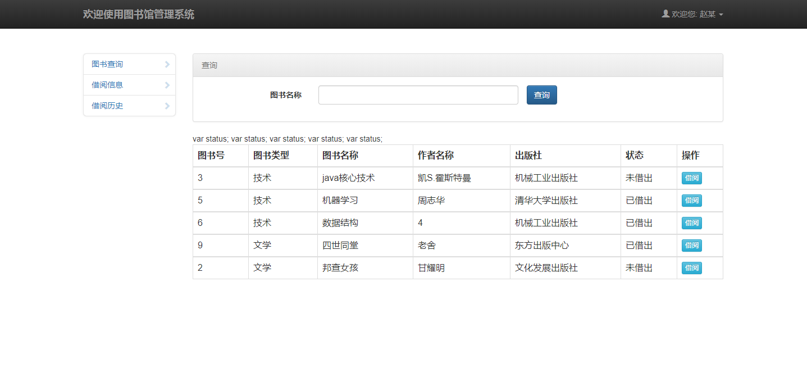

## 读者借书---最多借书3本

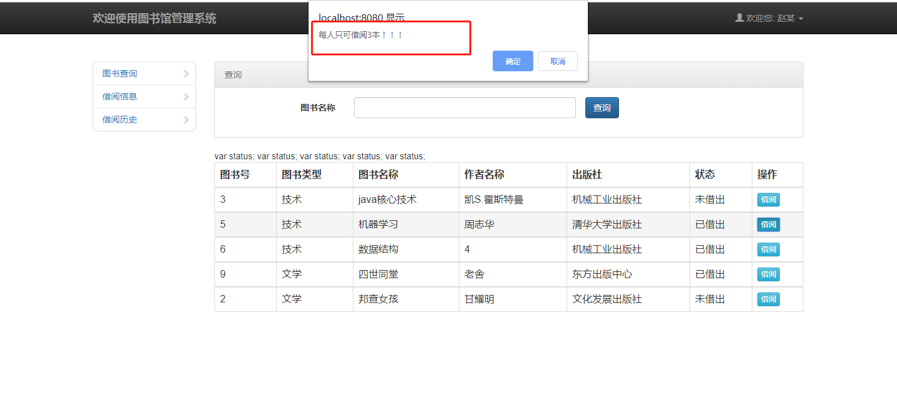

## 读者借书---两个月归还

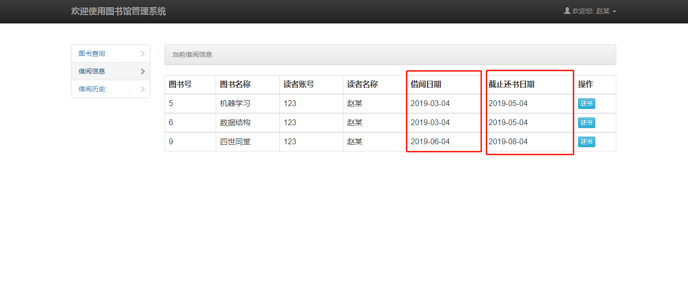

## 读者还书

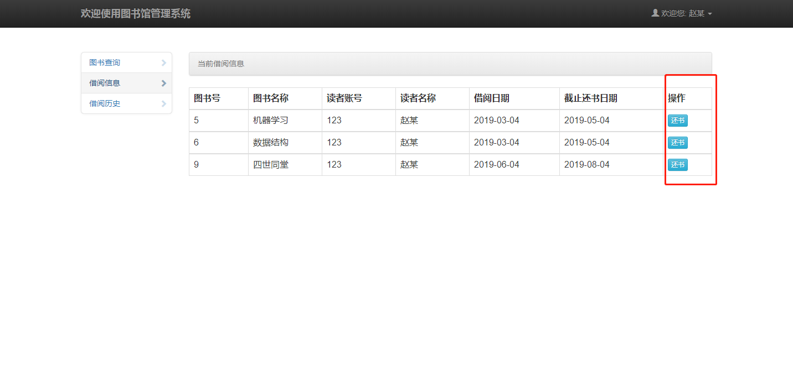

## 读者当前借阅信息页面

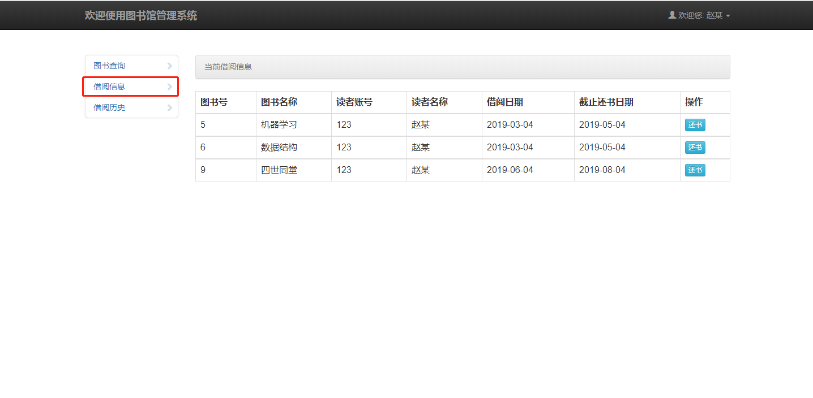

## 读者历史借阅信息显示页面

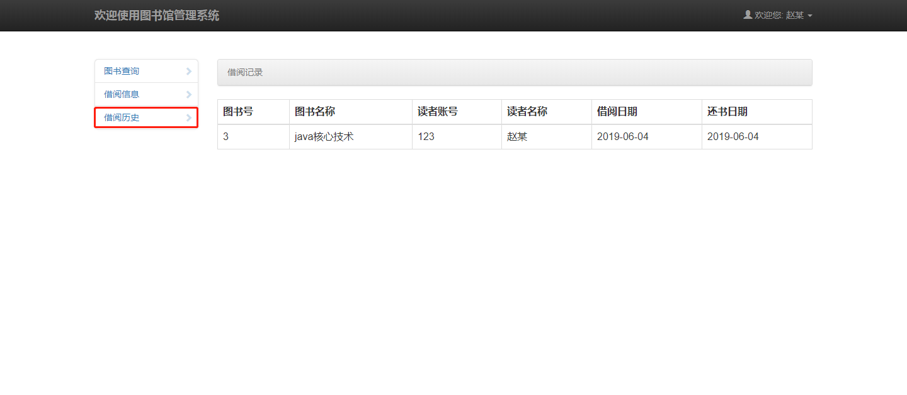

